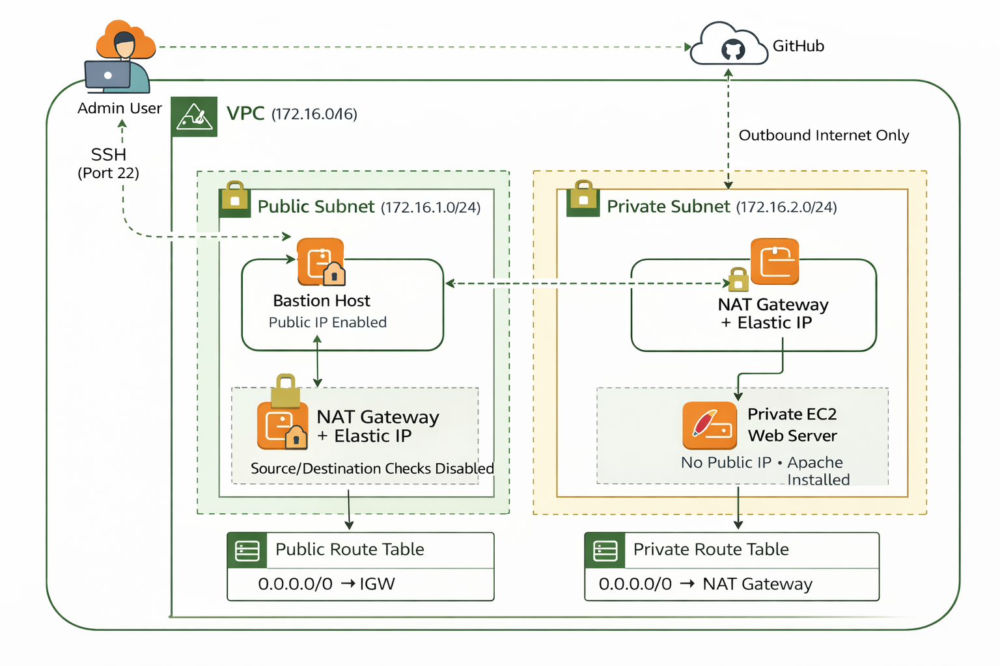

# 🔐 Secure Private EC2 Hosting using Bastion Host & NAT Gateway


---

## 📌 Project Overview

This project demonstrates a **secure and production-style AWS architecture** where a web server is deployed inside a **Private Subnet** without a public IP address.

The architecture ensures:

- Secure administrative access using a **Bastion Host (Jump Box)**
- Outbound internet access for private servers using a **NAT Gateway**
- Infrastructure provisioning using **CloudFormation (Infrastructure as Code)**

The private EC2 instance hosts a static website served using **Apache HTTP Server**.

---

## 🏗 Architecture Diagram



---

## 🧱 Architecture Components

- Custom VPC (10.0.0.0/16)
- Public Subnet (10.0.1.0/24)
- Private Subnet (10.0.2.0/24)
- Internet Gateway (IGW)
- NAT Gateway with Elastic IP
- Bastion Host (Public EC2)
- Private EC2 (Web Server)
- Public & Private Route Tables
- Security Groups
- CloudFormation Template

---

## 🔐 Security Design

### ✅ Zero Public Exposure
- Private EC2 has **NO public IP**
- Cannot be accessed directly from the internet

### ✅ Bastion-Based SSH Access
- SSH allowed only to Bastion Host from admin IP
- Private EC2 allows SSH only from Bastion Security Group

### ✅ Controlled Outbound Internet
- Private EC2 accesses internet only via NAT Gateway
- No inbound internet traffic allowed

### ✅ Least Privilege Security Groups
- Port 22 restricted
- Port 80 allowed only internally where required

---

## ⚙️ Tech Stack

- AWS EC2
- AWS VPC
- NAT Gateway
- Internet Gateway
- CloudFormation (IaC)
- Apache HTTP Server (httpd)
- Git
- Amazon Linux 2023

---

## 🚀 Deployment Steps

### 1️⃣ Deploy Infrastructure

```bash
aws cloudformation create-stack \
  --stack-name SecurePrivateWeb \
  --template-body file://cloudformation/template.yaml \
  --parameters ParameterKey=KeyName,ParameterValue=your-key-pair
```

---

### 2️⃣ Connect to Bastion Host

```bash
ssh -i your-key.pem ec2-user@<bastion-public-ip>
```

---

### 3️⃣ Jump to Private EC2

```bash
ssh -i your-key.pem ec2-user@10.0.2.x
```

---

### 4️⃣ Install Apache & Deploy Website

```bash
# Install Apache
sudo dnf install httpd -y
sudo systemctl start httpd
sudo systemctl enable httpd

# Install Git
sudo dnf install git -y

# Clone Website
cd /tmp
git clone https://github.com/Thananjeyan29/thananjeyan29.github.io.git

# Deploy to Apache root
sudo rm -rf /var/www/html/*
sudo cp -r thananjeyan29.github.io/* /var/www/html/

# Verify
curl http://localhost
```

---

## 📂 Repository Structure

```
aws-private-ec2-bastion-nat/
│
├── cloudformation/
│   └── template.yaml
│
├── architecture/
│   └── architecture-diagram.png
│
├── screenshots/
│
├── commands/
│
├── notes/
│
└── README.md
```

---

## 📸 Proof of Deployment

Screenshots included in `screenshots/` folder showing:

- CloudFormation stack creation
- Bastion SSH login
- Private EC2 SSH login
- Apache installation
- Website running successfully

---

## 💰 Cost Management

To avoid unnecessary AWS charges:

- NAT Gateway deleted after testing (charged hourly)
- Elastic IP released
- CloudFormation stack deleted
- All EC2 instances terminated

---

## 🎯 Key Learning Outcomes

- Designing secure VPC architecture
- Implementing Bastion host access pattern
- Understanding NAT Gateway routing
- Writing Infrastructure as Code using CloudFormation
- Practicing Linux server administration
- Deploying static web applications securely

---

## 👨‍💻 Author

**Thananjeyan (TJ)**  
Aspiring AWS DevOps Engineer  

- GitHub: https://github.com/Thananjeyan29  
- LinkedIn: (Add your LinkedIn URL here)

---
